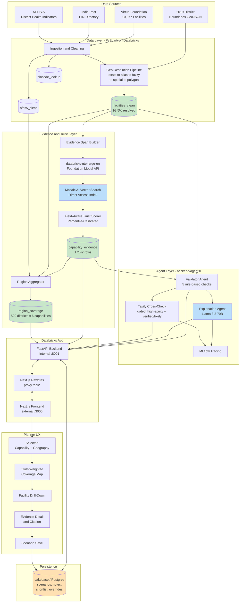

# Veridex
Evidence-first Healthcare Facility Intelligence App for India —
built for Hack-Nation's 6th Global AI Hackathon (Databricks Challenge).
## Problem Statement

Healthcare directories contain unverified capability claims, while missing information can be confused with a genuine medical desert. The challenge has no answer key or ground truth, so Veridex preserves uncertainty, cites evidence, and does not present estimates as verified facts.

## System Architecture



Sources feed PySpark ingestion and cleaning, which produces the gold tables. The evidence layer builds spans, embeds them, indexes them, and scores trust. The agent layer validates and explains the evidence and can perform a gated Tavily check. FastAPI serves data while Next.js provides the planner workflow. Lakebase preserves scenarios, notes, shortlists, and overrides.

## Track and Requirements Mapping

| Required component | What was built | Repository location |
|---|---|---|
| Evidence Engine | Field-level spans, Databricks embeddings, Vector Search retrieval, capability evidence rows | \`backend/vector_search/03_evidence_engine_and_trust_scorer.py\` |
| Trust Scorer | Field-aware weighting, percentile thresholds, keyword guard, band-consistency caps | Sections 7 and 8 of the evidence notebook |
| Planner's Workflow | Capability/geography selector, district map, facility evidence, scenarios | \`frontend/\`, \`backend/routers/\`, \`backend/services/\` |

## Data Pipeline

The ingestion notebook loads 10,077 Virtue Foundation facilities, India Post PIN data, NFHS-5 indicators, and supporting source fields. Safe casts preserve missing values as NULL with explicit reported flags instead of converting unknown values to zero or false.

Geography resolution runs in this order:

1. State spelling and formatting normalization.
2. Official district rename and alias handling.
3. Exact and constrained fuzzy matching with a blocklist.
4. Spatial centroid fallback for usable coordinates.
5. Point-in-polygon matching against 2019 district boundaries aligned to the NFHS-5 period.

Resolution progressed from 60.9% to 98.5%. Facilities that remain unresolved are retained and labeled unresolved rather than assigned a guessed geography.

## Evidence Engine and Trust Scoring

Evidence spans are built from description, capability, procedure, and equipment fields. Arrays are converted to readable text and large arrays are chunked so retrieval results can cite a field and text span.

The embedding endpoint is \`databricks-gte-large-en\`. Veridex uses a Mosaic AI Vector Search Direct Access Index. Delta Sync was evaluated but Free Edition throughput was approximately one row per second, which would have taken more than a week at the observed scale. Direct Access computes embeddings in controlled batches and upserts vectors into a genuine Vector Search index, which is appropriate for six fixed capability queries over approximately 40,000 vectors.

Trust scoring combines field-aware evidence weighting with a richness prior. The actual Vector Search similarity metric is on a small internal scale, so evidence bands use percentile-based dynamic thresholds instead of hardcoded cosine cutoffs. Trust percentage is derived from the weighted-score percentile and richness prior, then capped by final evidence status: no_signal 30, weak_signal 60, likely 90, and verified uncapped. \`trust_score\` remains \`trust_score_pct / 100\`.

The keyword guard checks capability-specific terms in likely and weak-signal spans. A likely row without a keyword is downgraded to weak_signal; a weak row without one is downgraded to no_signal. Verified and no_signal rows are unchanged.

## Agents

| Agent | Purpose | Technology | Gating | Called from |
|---|---|---|---|---|
| Validator Agent | Five deterministic evidence and data-quality checks | Pure Python, no LLM | Viewed facility capability | \`backend/services/facilities.py\` |
| Explanation Agent | Planner-facing constrained explanation | Databricks Foundation Model API, Llama 3.3 70B, MLflow | Viewed capability only | \`backend/services/facilities.py\` |
| Tavily Cross-Check | Independent digital-footprint check | Tavily API | ICU/NICU/Trauma/Oncology and verified/likely | \`backend/agents/tavily_check.py\` |
| Region Aggregator | Facility-to-district capability rollup | Databricks SQL/Python | Resolved district/state combinations | \`backend/agents/region_aggregation.py\` |

The Validator rules cover unsupported claims, single-source high-acuity signals, low legitimacy signals, unverified coordinates, and unresolved geography. The Explanation Agent must produce two or three sentences, match confidence language to evidence status, include field evidence structurally, and end with confirm_message. Tavily caches calls, handles unavailable credentials, and never bypasses its strict gate. Region aggregation maps verified/likely to verified coverage, weak_signal to weak coverage, and all-no-signal or absent evidence to no_facility.

## Tech Stack

| Layer | Technology | Purpose |
|---|---|---|
| Data processing | PySpark on Databricks | Cleaning, casting, joins, geography |
| Retrieval | Databricks Foundation Model API, Mosaic AI Vector Search | Embeddings and matching |
| Backend | FastAPI, Uvicorn, Databricks SQL connector | APIs and agent orchestration |
| Frontend | Next.js, React, MapLibre, Deck.gl | Planner map and evidence UI |
| Persistence | Lakebase/Postgres | Scenarios and planner state |
| Observability | MLflow | Explanation tracing |
| Deployment | Databricks Apps | Combined Node.js and Python runtime |

## Repository Structure

```text
backend/agents/                 Validator, explanation, Tavily, and aggregation modules
backend/ingestion/              Exported ingestion and geography notebooks
backend/vector_search/          Exported evidence and trust notebook
backend/routers/                FastAPI routes
backend/services/               Databricks and Lakebase service logic
backend/tests/                  Backend tests
frontend/app/                   Next.js routes
frontend/components/            Selector, map, evidence, scenarios, navigation
frontend/lib/                   API normalization and types
frontend/public/                Boundary assets
app.yaml                        Databricks Apps command and runtime settings
package.json                    Combined process orchestration
requirements.txt                Backend dependencies
```

## Setup and Local Development

```bash
git clone https://github.com/kodeezabdullah/Veridex-.git
cd Veridex-
npm install
npm --prefix frontend install
```

Set these environment variable names locally; never commit their values:

```text
DATABRICKS_SERVER_HOSTNAME
DATABRICKS_HTTP_PATH
DATABRICKS_TOKEN
TAVILY_API_KEY
LAKEBASE_INSTANCE_NAME
LAKEBASE_HOST
LAKEBASE_DBNAME
LAKEBASE_USER
LAKEBASE_SSLMODE
```

Run and test:

```bash
npm run build
npm run start
curl http://127.0.0.1:8001/health
curl "http://localhost:3000/api/regions/coverage?capability=NICU"
npm --prefix frontend run lint
pytest backend/tests -q
```

## Deployment

Databricks Apps runs the combined Node.js and Python pattern from the root \`package.json\` and \`app.yaml\`. The backend uses Databricks Apps service-principal OAuth through \`Config()\` and the SQL connector credentials provider. The app principal requires Can Use on the SQL warehouse, Unity Catalog access to \`veridex.gold\`, and a Lakebase Database resource. Secrets are not stored in source.

Next.js standalone output requires static and public assets inside the standalone server directory. \`frontend/scripts/copy-standalone-assets.mjs\` performs this copy after \`next build\`, and the frontend start script runs the generated standalone server.

## Known Limitations

- There is no ground truth or answer key. Scores and validation rates are evidence-based estimates, not accuracy against verified facts.
- Some facilities remain geographically unresolved and are labeled unresolved rather than guessed.
- The approximately 60 percent no_signal rate reflects observed facility composition, including small and single-specialty facilities, and is not by itself a system deficiency.
- Capability evidence is limited by the source fields and indexed text available for each facility.
- Tavily is optional, gated, and can return unavailable, error, no-footprint, or no-new-corroboration results.
- The map is district-level and depends on alignment with the 2019 ADM2 boundary asset.
- Lakebase scenario tables are created on demand and require the app principal to have resource access.

## License

Veridex is released under the MIT License. See \`LICENSE\` for the full text.
